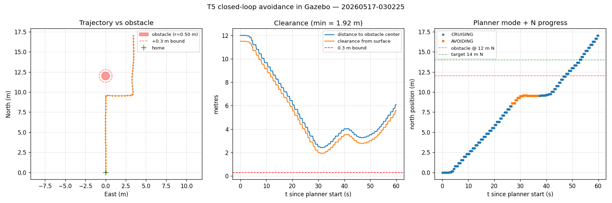

# AutonoBird

An AI-driven autonomous drone platform built on a HolyBro QUAV250 airframe, designed to demonstrate onboard perception, voice control, and mission execution using only edge hardware — no cloud connectivity required.

*T5 closed-loop avoidance against a Gazebo-physics-grounded obstacle. Left: drone trajectory sidestepping the 1 m diameter cylinder. Centre: clearance over time, minimum 1.92 m (6.4x over the 0.3 m dissertation bound). Right: planner mode + N-progress, CRUISING -> AVOIDING -> CRUISING.*

AutonoBird is a university dissertation project in Applied Computer Science. The aim is to show that a sub-£500 embedded system (Raspberry Pi 5 + HAILO AI HAT+) can deliver real-time obstacle detection and autonomous navigation comparable to commercial platforms on a fraction of the budget.

## Headline results

**138 ms** end-to-end perception loop on Hailo-8 (NFR1 target 250 ms) · **945 g** AUW with T/W ~2.5:1 · **1.92 m** minimum T5 clearance in Gazebo closed-loop (6.4x over the 0.3 m bound) · **25 m** SiK 433 MHz indoor through-wall LOS at **0** packet loss over 239 samples · **10/10** T6 mission replication at +/-5 % extent tolerance · **38 mm** max horizontal drift in 60 s GUIDED auto-hold (bound 500 mm).

## Tech stack

Raspberry Pi 5 (8 GB) · Hailo-8 NPU on Raspberry Pi AI HAT+ · Pixhawk 6C Mini · ArduCopter 4.6.3 · AR0144 USB global-shutter stereo · OpenCV SGBM stereo matching · YOLOv8n via HailoRT 4.23 · ExpressLRS over RadioMaster Pocket · HolyBro QUAV250 carbon-fibre airframe · ArduPilot SITL + Gazebo Harmonic for closed-loop validation.

## Documentation

Top-level docs live in `docs/`:

- [`architecture.md`](docs/architecture.md) — system overview, subsystems, data flow, control paths
- [`hardware.md`](docs/hardware.md) — BOM, weight budget, power architecture, airframe history
- [`software.md`](docs/software.md) — subsystem summaries, deployment model, capability table
- [`status.md`](docs/status.md) — detailed build milestone log
- [`engineering-backlog.md`](docs/engineering-backlog.md) — post-dissertation engineering work tracker

Subsystem-specific documentation lives alongside the code under `scripts/<subsystem>/`:

- [`scripts/flight-controller/readme.md`](scripts/flight-controller/readme.md) — Pixhawk port map, ArduPilot parameters, build log, pre-flight checklist, **Pi-side MAVLink bridge**
- [`scripts/autonomy/readme.md`](scripts/autonomy/readme.md) — flight-state machine, reactive avoider, perception sources, closed-loop SITL tests, **orchestrator**, **gesture pipeline + voice-vs-gesture rationale**
- [`scripts/perception/readme.md`](scripts/perception/readme.md) — YOLO detection + depth-fused perception on Hailo-8 (includes the `--jsonl` detection-event emitter that feeds the autonomy stack)
- [`scripts/sitl/readme.md`](scripts/sitl/readme.md) — ArduPilot SITL setup, QUAV250 parameter overlay, scripted missions, **Gazebo Harmonic obstacle world + iris_with_lidar model** under `scripts/sitl/gazebo/`
- [`scripts/ar0144/steps.md`](scripts/ar0144/steps.md) — stereo camera calibration (40-pose guided)
- [`scripts/jarvis/context.md`](scripts/jarvis/context.md) — local voice assistant
- [`scripts/pico-led/setup-guide.md`](scripts/pico-led/setup-guide.md) — status LEDs on the Pico 2 W (code complete, hardware blocked)
- [`scripts/demo/readme.md`](scripts/demo/readme.md) — one-command tmux launchers for the May 2026 presentation demos

## Related projects

Two sibling tools live in separate repos and are referenced in the dissertation but are not part of the AutonoBird airframe stack:

- [**Benchy**](https://github.com/JabbaghYounes/Benchy) — edge-AI NPU benchmark suite. Runs on two bench-only Pi 5 test rigs (Pi A: 16 GB / Hailo-8, Pi B: 4 GB / Hailo-10H) to empirically pick which HAT variant flies on the drone. The 2.6x-6.9x Hailo-8 advantage that drove the AutonoBird NPU decision came out of this suite.
- [**UPSentinel**](https://github.com/JabbaghYounes/UPSentinel) — desktop tray indicator for the Waveshare UPS HAT (B) on Pi OS Bookworm. Deployed alongside Benchy on both test Pis as visible UPS-battery monitoring while benchmarks run. The drone itself does not run UPSentinel — the airframe is UBEC-powered.

## Licence

[MIT](LICENSE).
