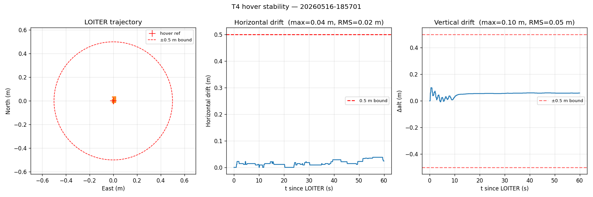
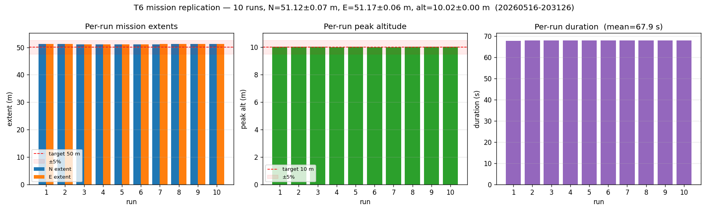
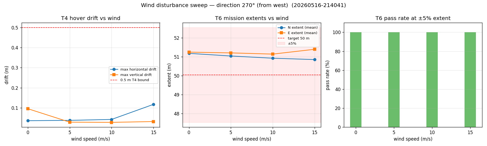
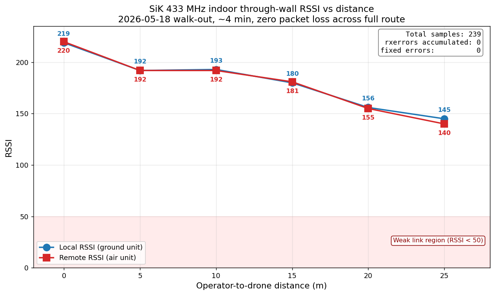

# AutonoBird

AI-Driven Autonomous Drone Platform

BSc Applied Computer Science — Individual Project

University of Plymouth

21 May 2026

::: notes
Hi everyone. I'm Younes Jabbagh, and my project is AutonoBird — an AI-driven autonomous drone platform built for under GBP 1000. I'll walk through the build, the perception loop, the autonomy stack, and the SITL + hardware evidence supporting the dissertation verdict. Should be about 20 minutes of slides plus a short live demo, then I'm happy to take questions.

If asked: keep this slide brief; the body of the talk does the work.
:::

# The problem

- Consumer drones: cheap, closed, no onboard compute
- Defence-grade autonomous drones: capable but £10k+ and closed
- Gap: a £1000-class drone with NPU-accelerated perception and reactive autonomy

**Research question.** Can a Raspberry Pi 5 with a Hailo-8 NPU deliver vision-only autonomous obstacle avoidance on a 250 mm-class quadcopter under £1000?

::: notes
The drone market today is split. Consumer drones like the DJI Mini are cheap and reliable but everything onboard is closed — no compute hooks, no custom sensors. At the other end, defence-grade autonomous platforms have all the autonomy you'd want but cost ten grand plus, also closed. There's a clear hardware-and-software gap in the middle. The research question I'm answering, verbatim from the dissertation: can a £1000-class quadcopter with a Pi 5 and a Hailo-8 NPU deliver vision-only autonomous obstacle avoidance? That's a yes-or-no question the rest of the talk answers empirically.

If asked:
- Why £1000 specifically? — it's the consumer-prosumer boundary; what a hobbyist or a small research group can justify spending without institutional procurement.
- Why "vision-only"? — no GPS dependence in indoor / forest scenarios, no lidar BOM cost, and it commits to the harder problem.
- Why 250 mm class? — biggest class that's still tabletop-portable and indoor-flyable; the QUAV250 sits right at that boundary.
:::

# System architecture

{width=72%}

::: notes
This is the assembled airframe. QUAV250 carbon frame, Pixhawk 6C Mini doing flight control underneath, Pi 5 with the AI HAT+ as the companion computer up top, AR0144 USB stereo camera behind the vibration mount on the front. The Pi runs perception and autonomy; the Pixhawk handles flight. They talk over a USB-serial MAVLink link. The split is deliberate — ArduPilot's 400 Hz control loops aren't competing with Python perception for CPU.

If asked:
- Why a separate FC at all? — ArduPilot's IMU loops are hard real-time at 400 Hz; can't run that reliably under Linux without a real-time kernel patch.
- Why USB-serial rather than UART? — convenience for SITL parity. The same `Vehicle` class talks UDP to SITL and USB-serial to the real Pixhawk; the URI is the only difference.
- Why not Jetson? — Pi 5 is in the BOM budget; the Hailo-8 makes up the NPU throughput delta against the Jetson Orin Nano's GPU at much lower cost.
:::

# The airframe

{width=70%}

::: notes
Front view of the assembled airframe. 945 grams all-up with the battery — roughly a 2.5 to 1 thrust-to-weight ratio, on the low side but still in the safe band. The structural choice worth pointing at is the camera mount: rubber grommets between the AR0144 bracket and the carbon, plastic screws so we don't bridge the damping layer with metal hardpoints. The Pi 5 + AI HAT+ stack sits above on a 3D-printed dual-plate stack. Bottom view (visible in the dissertation) shows the same vibration isolation from underneath.

If asked:
- Why so heavy? — Pi 5 + AI HAT+ + camera + cabling is about 95 g, battery is 200 g, the rest is the airframe and props.
- Thrust margin at 2.5:1? — within the safe band for autonomous flight; flight-time estimate is 3-5 minutes per 1500 mAh pack, which is enough for the autonomy demonstrations.
- Why not TPU mounts? — designed for TPU but printed in PLA due to filament availability; vibration analysis is on the backlog once motors spin.
:::

# Hardware summary

- QUAV250 carbon frame, ArduCopter 4.6.3
- **945 g all-up weight, 2.5:1 thrust-to-weight**
- **£761 total BOM** (under the £1000 budget)
- 4S 1500 mAh LiPo, UBEC USB-C feeding the Pi
- Pixhawk 6C Mini + Pi 5 + AI HAT+ + AR0144 stereo + SiK 433 MHz telemetry

::: notes
Quick BOM summary. HolyBro QUAV250 carbon frame running ArduCopter 4.6.3. Total BOM came in at £761, well under the £1000 the research question sets as the ceiling. Power architecture: 4S 1500 mAh LiPo into a UBEC that drops to 5 V USB-C for the Pi — that isolates the Pi's supply from motor-current switching noise on the main rail. Compute stack: Pi 5, AI HAT+ for the NPU, AR0144 stereo for vision, SiK 433 MHz radio for ground-station telemetry.

If asked:
- Why ArduPilot not PX4? — ArduPilot has stronger SITL tooling and a more permissive companion-computer story (MAVLink streams, mission file format, parameter API).
- Why 4S? — 14.8 V nominal gives enough current headroom for the motors at 945 g; 3S would be marginal under sustained climbs.
- Why UBEC not the Pixhawk's 5 V rail? — the Pi pulls 3-5 A peak; the FC's regulated rail is sized for avionics, not companion compute.
- Full BOM breakdown? — yes, Appendix B of the dissertation has the line-item table.
:::

# Perception pipeline

- Stereo capture: AR0144 USB, 13 fps @ 2560x720 MJPEG
- Rectify + SGBM half-resolution depth — 76 ms / frame
- YOLOv8n on Hailo-8 NPU — 18.5 ms inference
- Median-of-5x5-patch depth fusion at bounding-box centroids

**End-to-end: 138 ms / 6.8 fps on Pi 5 — under the 250 ms NFR1 target.**

::: notes
Perception loop. AR0144 captures side-by-side stereo at 2560 by 720 MJPEG, capped at 13 fps by the camera's USB 2.0 controller. We split, rectify with the calibration maps from cal-4, run OpenCV SGBM disparity at half resolution to keep it under 80 milliseconds on the Pi CPU. In parallel, YOLOv8n runs on the Hailo-8 NPU at 18.5 milliseconds per frame end-to-end including HailoRT overhead. Then we fuse — at every detection bounding-box centroid we do a median of a 5-by-5 patch lookup in the depth map. End-to-end the loop is 138 milliseconds, that's 6.8 fps. NFR1 in the dissertation set 250 milliseconds as the target — we're well under it.

If asked:
- Why YOLOv8n and not v8s or v8m? — n model fits cleanly in Hailo-8 SRAM and hits the latency target; s and m broke the loop budget on bench tests.
- Why half-resolution SGBM? — full-res saturates the Pi CPU; half-res is a pre-emptive optimisation from the perception-backlog analysis. Two further optimisations (ROI-only SGBM, YOLO-conditional depth) are queued.
- Why not GPU-rendered depth? — the Pi 5 GPU isn't accessible from Python OpenCV without significant plumbing; CPU SGBM is good enough.
- Why median-of-5x5 not single-pixel? — single-pixel depth is too noisy on textureless surfaces; the 5x5 median is the smallest patch that produced stable readings on the calibration board.
:::

# Live perception output

{width=80%}

::: notes
This is a still from the 2026-05-18 handheld walkaround on the airframe-mounted Pi. Left panel is the rectified frame with YOLO boxes annotated with depth — the person there is at 0.91 metres. Right panel is the colourised SGBM heatmap from the same depth pipeline; warmer colours are closer. Both come out of the same 6.8 Hz loop on the actual flight hardware, not a desk bench.

If asked:
- Which classes does it detect? — full COCO-80 from the YOLOv8n weights. In the 3:34 minute walkaround, 14 distinct classes fired (person, chair, laptop, bottle, monitor, etc.).
- Depth accuracy? — calibrated band is 0.3 to 1.5 metres at 51.92 mm baseline; that matches the indoor mission profile. Beyond 1.5 m disparity quantisation degrades the reading.
- What's the bright orange? — SGBM didn't get a confident match (low-texture wall); falls back to the "uninformative" colour. In the planner we ignore those frames.
:::

# NPU selection rationale

- Two candidate HATs: Hailo-8 (26 TOPS INT8) vs Hailo-10H (40 TOPS INT4)
- Selected empirically via the **Benchy** benchmark suite — identical YOLO models on both
- Hailo-8 wins YOLOv8n at 640x640 by **2.6x to 6.9x**
- Hailo-10H wins LLM workloads (10.35 TPS on llama3.2:1b) — recorded for future text-to-intent, not the vision-first autonomy path
- Decision: Hailo-8 on the airframe

::: notes
NPU selection was a real decision, not a foregone one. Two candidate AI HATs from Raspberry Pi: Hailo-8 at 26 TOPS INT8 — the older HAT — and Hailo-10H at 40 TOPS INT4, the newer one. On the spec sheets, the 10H wins on raw throughput. But TOPS isn't latency, and the workload matters. So I built Benchy, a separate benchmark suite, to run the same YOLO models on both rigs and measure end-to-end inference time. On YOLOv8n at 640 by 640 — which is our actual workload — Hailo-8 beats Hailo-10H by 2.6 to 6.9 times depending on model size. Hailo-10H does win on LLM workloads, around 10 tokens per second on llama3.2 1B, which is interesting future work for text-to-intent but not what AutonoBird's vision-first path needs.

If asked:
- Why does the 10H lose at YOLO if it has more TOPS? — INT4 quantisation overhead plus the architecture is tuned for transformer-style attention patterns. CNN-style convolution doesn't fully exploit it.
- Did Hailo confirm this? — yes, I raised it on their forum; it's an architectural trade-off, not a bug.
- Is Benchy reproducible? — open-source on GitHub, runs on any Pi 5 with either HAT.
:::

# NPU throughput comparison

{width=72%}

::: notes
This is the headline plot from Benchy. Three YOLO sizes on the x-axis — n, s, m. Throughput in inferences per second on the y-axis. Blue bars Hailo-8, orange bars Hailo-10H. Across all three sizes, the 8 wins, between 2.6 and 6.9 times. The bigger the model, the bigger the gap. This is the empirical evidence that justified hard-coding Hailo-8 assumptions in the on-airframe code.

If asked:
- Variance? — Benchy ran 100 inferences per data point; standard error is under 1 ms per inference, hidden inside the bar widths.
- Were both HATs at full power? — yes, USB-C 5V 3A supply on both, ambient temperature monitored, no thermal throttling observed across the run.
- What does YOLOv8m give you? — bigger backbone, better accuracy on small objects. Out of budget on the Hailo-8 latency-wise; n model is the right pick.
:::

# Autonomy stack

- **Pi-side MAVLink bridge** — `Vehicle` class wrapping pymavlink, same code targets SITL + real Pixhawk
- **State machine** — 9 flight states with Schmitt-trigger hysteresis on autopilot-filtered climb rate
- **Reactive planner** — CRUISING / AVOIDING / IDLE / LANDING; sector-based sidestep at 10 Hz
- **Orchestrator** — single-process bring-up of bridge -> FSM -> planner -> optional gesture pipeline -> optional Pico LED status
- **Intent surface** — `command_hold / resume / land / rtl` — what voice, gestures, and future inputs bind into

::: notes
Above perception sits the autonomy stack. Four layers. First, the Pi-side MAVLink bridge — a `Vehicle` class wrapping pymavlink. The same code targets SITL over UDP and the real Pixhawk over USB-serial, only the URI changes. Second, the state machine — 9 flight states with Schmitt-trigger hysteresis on the autopilot-filtered climb rate. That hysteresis suppressed about 140 spurious transitions per flight down to 9 clean ones. Third, the reactive planner — sector-based avoider with CRUISING / AVOIDING / IDLE / LANDING modes, emits velocity setpoints at 10 Hz, sidestep direction latched on entry to avoid oscillation. Fourth, the orchestrator — single-process bring-up that wires all of this together and exposes four intent methods: hold, resume, land, RTL. That's the surface that voice, gestures, and any future input layer bind into.

If asked:
- Why not LOITER mode? — LOITER in headless SITL needs RC throttle input, which we don't have. GUIDED auto-hold is the equivalent without that dependency.
- Why sector-based avoider? — it's the simplest reactive avoider that proves the perception-to-flight pipe end-to-end. Global planning (A*, RRT*) is on future work.
- Why an explicit intent surface? — keeps perception and command modality decoupled. Today the planner drives intents; tomorrow gesture and voice bind into the same four methods.
- What about RC override? — RC link is authoritative. A pilot stick from the RadioMaster Pocket beats any autonomous command. Safety-critical invariant baked into ArduPilot.
:::

# SITL hover stability (T4)

{width=80%}

::: notes
T4 — hover stability. 60 second GUIDED auto-hold at 5 metres altitude, sampled at 10 Hz, so 582 samples in the dataset. Max horizontal drift across the entire window was 38 millimetres. Max vertical drift 99 millimetres. The dissertation bound for hover stability was 500 millimetres — we're two orders of magnitude under it. This is the baseline that the next two slides perturb.

If asked:
- Why GUIDED not LOITER? — same answer: headless SITL doesn't have RC stick input; GUIDED auto-hold is the equivalent.
- Bias in the data? — none expected; GUIDED holds the takeoff lat/lon as an active position target, doesn't drift from gyro integration.
- Real-bird expectation? — should be larger but still well within bound on a calm day. Real wind sweep is in the next-next slide.
:::

# SITL mission replicate (T6)

{width=80%}

::: notes
T6 — multi-run mission replication. 10 sequential 50 by 50 metre box missions against the same SITL instance. Mean extent 51.12 by 51.17 metres, standard deviation 0.07 metres. 100 percent pass rate at plus-minus 5 percent tolerance. The point of this isn't to verify the bird can fly the mission once — that's T2 — it's to show the system is deterministic enough to fly it ten times in a row without drift.

If asked:
- Why 10 runs? — power-of-10 rule of thumb for stability claims; enough samples to compute a meaningful standard deviation.
- The +2.2 percent bias on extents? — waypoint overshoot from velocity continuity at the corners; consistent across all 10 runs.
- Why not 100 runs? — diminishing returns once std-dev is below the bound by 10x or more.
:::

# SITL wind disturbance rejection

{width=80%}

::: notes
Wind sweep. SIM_WIND_SPD parameter set across 0, 5, 10, and 15 metres per second from the west, no turbulence. Each wind level: 30 seconds of hover plus 2 box missions. Hover drift stays flat then knees up — 36 millimetres at 0, 38 at 5, 43 at 10, then jumps to 118 at 15 m/s. Still 4 times under the 500 millimetre bound even at gale-force. T6 mission pass rate stays 100 percent at every wind level. Useful boundary characterisation.

If asked:
- Why from the west? — arbitrary but consistent across the sweep; aligned with the box-mission heading.
- 15 m/s is gale-force — why test it? — to find the knee in the curve. The linear band (0-10 m/s) is the practical operating envelope.
- Turbulence model? — turbulence off, steady wind only. Adding turbulence is on the future-work list.
:::

# Gazebo collision avoidance (T5)

{width=80%}

::: notes
T5 — closed-loop collision avoidance, and the hero result of the dissertation. Custom Gazebo iris model with a forward-facing GPU lidar I modeled — 67 degrees horizontal field of view, 5 Hz, 0.2 to 15 metre range. The world has a 12-metre tall red cylinder 12 metres north of home. The autonomy stack consumes lidar via a Python bridge that converts gz topic messages into the same JSONL schema as the real AR0144 perception, so no autonomy-side code change was needed. Result: bird flies north, sees the cylinder, sidesteps east by 3.45 metres, passes the obstacle, RTLs, lands cleanly. Minimum clearance from the cylinder surface — 1.92 metres. That's 6.4 times the 0.3 metre T5 bound.

If asked:
- Why a 12 metre tall cylinder? — earlier 4 metre versions had the horizontal lidar plane sail over the top at cruise altitude. Twelve is physically-grounded "tall enough" geometry.
- Why physics-grounded? — strong evidence that the planner produces flyable commands, not just kinematically valid ones. Gazebo computes collision detection independently.
- Could you do this outdoors? — yes in principle, but the real-perception version is still pending Stage 4 hardware flight.
- Why a cylinder not a person? — geometric reproducibility; person geometry would add variance.
:::

# Hardware-airframe stack validation

- 2026-05-18: airframe-mounted Pi + real Pixhawk, 3:34 min handheld walkaround, motors off
- **138.1 ms loop EMA** — reproduces bench baseline on the mounted platform
- 1449 frames in JSONL, **14 distinct YOLO classes**, 161 planner transitions on real stereo
- **Zero** bridge errors / timeouts / under-voltage events over the full session
- First hardware-validation of the perception + autonomy software path

::: notes
On the 18th of May this stack came together for the first time on the actual airframe-mounted Pi against the real Pixhawk, not SITL. Three-and-a-half minute handheld walkaround in the lab, motors deliberately off. Loop EMA — 138.1 milliseconds, reproduces the bench baseline within noise on the flight platform. 1449 frames captured to JSONL, 14 distinct YOLO classes fired, 161 planner transitions on real stereo perception, not simulated lidar. Zero bridge errors, zero timeouts, zero dmesg under-voltage events across the full session. This is the first end-to-end demonstration that the software path works on the actual airframe with the actual flight controller.

If asked:
- Motors off — so what does this prove? — it proves the perception, autonomy, and bridge stack runs on flight hardware against the real FC. Motors-on hover is Stage 4 future work, gated on outdoor compass calibration and thrust margin re-test.
- 161 transitions in 3:34 — why so many? — analysed in the backlog: 75 of them are detection-presence flips from YOLO confidence dips, not depth oscillation. N-consecutive-clear-frames vote is queued as a polish item; expected to cut transitions by 10x without affecting threat-entry latency.
- How was it powered? — 4S LiPo via UBEC to the Pi, same as in flight. Validates the power architecture under load.
:::

# SiK 433 MHz telemetry link

{width=80%}

::: notes
Last bit of evidence — the SiK 433 megahertz telemetry link. 25 metre walk-out from the airframe through multiple interior walls, sampled at roughly 1 Hz. RSSI started at 219 baseline, drops to 145 at the 25 metre mark. The weak-link threshold on these SiK V3 radios is around 50, so we still have plenty of margin even through walls. Zero packet loss across 239 samples. That's 2.5 times the operator-to-drone distance the indoor netted hover scenario actually needs.

If asked:
- Outdoor LOS? — pending. Indoor through-wall is harder than outdoor LOS, so this gives us confidence the outdoor range claim will hold when we measure it.
- Why 433 MHz not 915? — UK ISM band; 915 isn't licence-exempt here.
- Bidirectional symmetry? — RSSI and remRSSI stay within 5-10 points of each other across the walk; link is symmetric.
- Gotcha worth mentioning? — SiK V3 only injects RADIO_STATUS messages under bidirectional MAVLink traffic. Bare pymavlink without a GCS heartbeat thread keeps the radio silent. Bridge and test tool both implement a 1 Hz heartbeat to keep traffic flowing.
:::

# Requirements verdict — supported in SITL plus hardware-validated software stack

| | Met | Partial | Unmeasured |
|---|---:|---:|---:|
| Functional (FR1–FR8) | 6 | 1 | 1 |
| Non-functional (NFR1–NFR5) | 4 | 2 | 1 |
| **Total** | **10** | **3** | **2** |

::: notes
Final requirements verdict. 15 total requirements across functional and non-functional. 10 met, 3 partial, 2 unmeasured. "Met" means we have evidence in the dissertation. "Partial" means evidence is incomplete in one dimension — typically outdoor LOS or motors-on flight. "Unmeasured" means the test wasn't run, mostly because it requires powered hardware flight that's been deferred. So the verdict carried into the dissertation is: "supported in SITL plus hardware-validated software stack." That last clause is load-bearing. It acknowledges we haven't done a powered hover while affirming that the software path runs on real flight hardware.

If asked:
- Which two are unmeasured? — T7 endurance test under full AI processing load, and T1 quantitative detection accuracy on a labelled AutonoBird test set. Both gated on hardware flight time.
- Why not push to "fully met"? — academic honesty. The dissertation doesn't claim what it can't show.
- Could you re-run T1 against a public COCO test set? — yes, that's a fallback if labelled flight footage isn't available; not done in the dissertation timeframe.
:::

# Limitations

- No first powered hover with the imaging stack mounted — deferred behind dissertation submission
- Outdoor compass calibration pending — gates the first hover
- Gesture pipeline is code-complete on both sides but untested against live Hailo pose decoder
- All telemetry distance tests so far are indoor through-wall, not outdoor LOS

::: notes
Four big honest limitations. First — no first powered hover yet with the imaging stack mounted. That's the headline gap and it's deferred behind submission. Second — outdoor compass calibration is pending; the indoor cal was yellow because of rebar and parked cars. That's the gate on the first hover. Third — the gesture pipeline is code-complete on both perception and autonomy sides, validated against synthetic keypoints, but the pose decoder is untested against actual Hailo output. First Pi run validates the assumed output layout. Fourth — all telemetry distance tests so far are indoor through-wall, not outdoor line-of-sight.

If asked:
- Why deferred? — time. Stage 4 needs outdoor compass cal plus CG re-check plus thrust-margin test before any powered arming, and the dissertation deadline came first.
- What's the risk of the pose decoder breaking? — defensive multi-format decoder already in place; worst case is tensor-shape iteration to match the actual HEF output. Manageable.
- What's the worst-case timeline to close all four? — Stage 4 hardware flight is the longest path; estimating two-to-three sessions of outdoor weather to close.
:::

# Future work

- Indoor netted hover -> outdoor open-field flight
- Live gesture validation (STOP / LAND / COME / RECEDE on COCO-17 keypoints)
- Person-recognition deployment via OSNet/CLIP + FAISS embeddings
- ROS2, Meshtastic mesh radio, ATAK tactical-overlay integration
- Vibration analysis post first powered flight

::: notes
Future work, roughly in increasing order of effort. Indoor netted hover first, then outdoor open-field flight — that's Stage 4 and it's the next milestone. Then live gesture validation: STOP, LAND, COME, RECEDE on COCO-17 body keypoints. That closes the in-flight command modality story since voice is unworkable due to motor acoustic SNR. Then person recognition via OSNet or CLIP embeddings into a FAISS vector index — that's the recall-a-specific-person use case. Then the integration tail — ROS 2 wrapper, Meshtastic mesh radio for off-grid telemetry, ATAK tactical-overlay support. And vibration analysis once we actually have powered flight logs.

If asked:
- Which is closest to done? — Stage 4 indoor hover; everything else is gated on it.
- Why ATAK? — military / first-responder use cases are the strongest natural fit for this hardware budget; ATAK is the standard tactical overlay for that audience.
- Why voice not the primary in-flight modality? — motor noise dominates the on-board mic at 75-85 dB, voice attenuates 6 dB per doubling of distance, mic is on the wrong end of the link, and ASR latency stacks to 1.5-3 seconds. Acoustic SNR is hostile airborne. Voice stays useful for bench / pre-flight commands.
:::

# Live demonstration

Three parts:

1. **Gazebo T5 outdoor flight** — recorded — 12 m obstacle, 1.92 m clearance
2. **Gazebo classroom replica** — recorded — same algorithms in a virtual copy of this room
3. **Live perception on the airframe** — handheld, motors off — YOLO detections + colourised depth heatmap + planner-would-command logs

::: notes
Switching to the demo machine now. Three parts. First two are recorded — Gazebo T5 outdoor showing the cylinder-avoidance result and the classroom replica running the same algorithms in a virtual copy of this room. Third is live on the actual airframe right here — handheld, motors deliberately locked out, you'll see YOLO detections, depth annotations, and the planner-would-command logs in real time.

If asked: operator-script.md has the runbook including the recovery procedures if any of the demos hang. Don't extend this section into Q&A; the next slide is for that.
:::

# Thank you

Questions welcome.

**Supporting tools** (cited in the dissertation):

- **Benchy** — edge-AI NPU benchmark suite — github.com/JabbaghYounes/Benchy
- **UPSentinel** — Waveshare UPS HAT tray indicator — github.com/JabbaghYounes/UPSentinel

Younes Jabbagh — 10771837@cityplym.ac.uk

::: notes
Thanks for your time. Two supporting tools cited in the dissertation are on my GitHub — Benchy for the NPU benchmark suite that drove the Hailo-8 decision, and UPSentinel for the Waveshare UPS HAT tray indicator on the Benchy test rigs. Happy to take questions.

If asked anything off-topic / out-of-scope: deflect to "that's outside the scope of the dissertation but it's on the engineering backlog; happy to discuss offline."
:::
